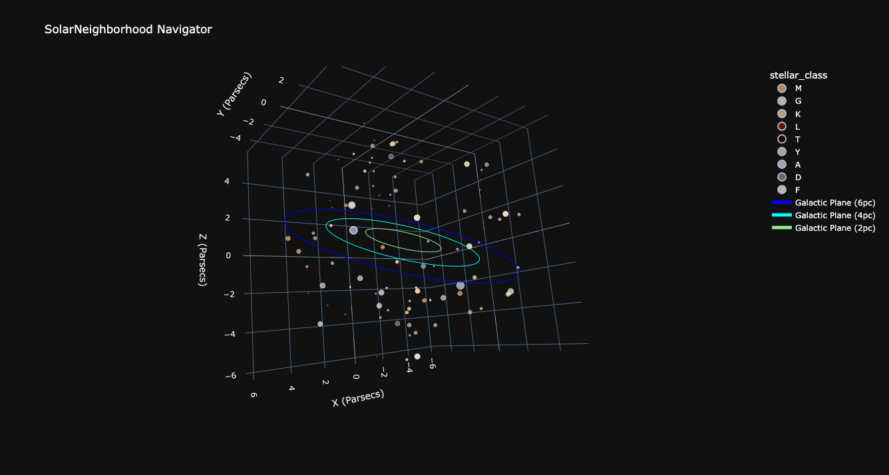

# SolarNeighborhood Navigator



## Overview

This Python-based tool allows you to navigate through the local solar neighborhood, and witness the stars within the nearest ~6 parsecs of Earth.

## Notes

I have no background in cosmology or astronomy, this is a project based out of pure fun and interest. There may be great inaccuracies in the locations of stars relative to the
Earth's equatorial coordinate system or inaccuracies relative to the galactic coordinate system.

The stellar data, including name of the system, equatorial coordinate, distance, and solar mass come from the second table in the following [Wikipedia](https://en.wikipedia.org/wiki/List_of_nearest_stars) article. 

As the solar mass is used to determine the size of the marker on the plot, certain values were changed from the initial table. Values that had a range were averaged to the mean, and empty values were filled with estimates.

The right ascension component of each star's equatorial coordinates are converted to degrees. The right ascension and declination are then converted from spherical coordinates to cartesian coordinates for plotting.

## Usage

This project was implemented using NumPy and Plotly to build a real-time, interactive
map of the local solar neighborhood. This represents many of the star systems within 
the nearest 20 light-years (~6 parsecs) to Earth. By default, a blue ring represents the galactic
plane, which is a disk oriented along the most flat and dense portion of the Milky Way
galaxy. 

To use the tool, simply run the SolarNeighborhood.py script to try it out. 
```bash
$ make init
$ python src/SolarNeighborhood.py
```

There are a couple command-line arguments for changing the behavior of the SN Navigator. `-s`/`--silent` mutes the std output printing the data for all the stars being displayed. `-r`/`--rings` accepts integer values between 0-3 (inclusive) which determines how many concentric rings are displayed along the galactic plane. This defaults to 1, and can be disabled with a 0 value.
```bash
$ python src/SolarNeighborhood.py -s -r 3
```


